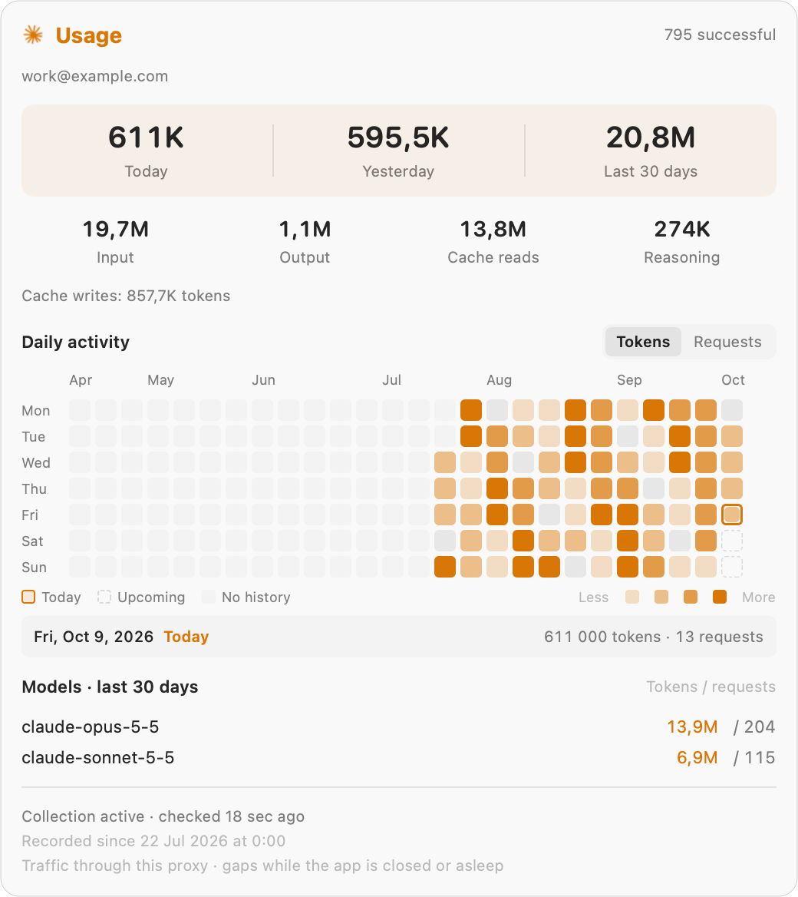

<p align="center">
  
</p>

<h1 align="center">CLIProxyBar</h1>
<p align="center">Your CLIProxyAPI quotas, at a glance. A standalone macOS menu bar app.</p>

CLIProxyBar connects to your local or remote CLIProxyAPI instance and shows quota usage for each account.
A compact menu keeps the essentials close. Option-click opens an expanded view with reset times and pace indicators.

## Screenshots

<table>
  <tr>
    <th>Compact view</th>
    <th>Option-click for details</th>
  </tr>
  <tr>
    <td valign="top">
      <picture>
        <source media="(prefers-color-scheme: dark)" srcset="docs/screenshots/compact-dark.png">
        
      </picture>
    </td>
    <td valign="top">
      <picture>
        <source media="(prefers-color-scheme: dark)" srcset="docs/screenshots/expanded-dark.png">
        
      </picture>
    </td>
  </tr>
</table>

**Usage card**

<picture>
  <source media="(prefers-color-scheme: dark)" srcset="docs/screenshots/usage-dark.png">
  
</picture>

Images show the current interface with fictional accounts and sample usage.
Light and dark images follow your color preference.

## Features

- Compact and expanded menus with provider colors and quota gauges.
- Usage or remaining percentages, with optional provider indicators in the menu bar.
- Pace markers and reserve or deficit estimates for supported fixed quota windows.
- Cached readings at launch, followed by fresh provider requests.
- Account hover panels with optional token history, model totals, and daily activity.
- One refresh action, a refresh indicator inside the menu, and the ⌘R shortcut.
- Optional quota reset notifications and confetti for weekly or monthly resets.
- Local or remote proxy URL and management key settings, available with ⌘,.

## Supported quotas

| Provider | Windows | Extra information |
| --- | --- | --- |
| Claude Code | Five-hour session, weekly | Plan label when CLIProxyAPI supplies it |
| Codex | Session, weekly | Plan label and available resets when the provider supplies them |
| OpenCode Go | Rolling, weekly, monthly | Plan label through the generic plugin quota API |
| Antigravity | Provider quota groups or per-model limits | Project and plan lookup; response fixtures tested |
| Generic quota plugins | Windows supplied by the plugin | Separate groups, reset times, plan labels, numeric summaries |

OpenCode Go requires CLIProxyAPI v8 and a plugin that implements the generic quota capability.
The companion [OpenCode Go plugin](https://github.com/massiveits/opencode-go-cliproxyapi) needs the native quota changes in [upstream pull request #10](https://github.com/massiveits/opencode-go-cliproxyapi/pull/10).
A plugin version that exposes only its separate quota page does not work with this integration.

Pace compares used quota with elapsed time in a fixed window. It is an estimate, not a provider guarantee.
OpenCode Go weekly quotas have pace indicators. Its rolling and monthly responses do not supply enough window metadata for pace calculations.
Every configured provider can appear in the menu and the optional usage history.
Settings includes detected providers, so you can choose their menu bar indicators.
Providers without an allowance API show no quota data. Unknown quota does not mean zero usage.

CLIProxyAPI also routes Gemini, Vertex AI, AI Studio, Kimi, Grok, Devin, Meta and compatible API endpoints.
Additional providers depend on the installed plugins and CLIProxyAPI version.
Routing support alone does not establish an API for subscription quotas.
CLIProxyBar discovers plugin capabilities through `GET /v0/management/quota/providers` and account `supports_quota` flags.
It reads normalized quotas through `POST /v0/management/quota/fetch`.
Plugins that implement these endpoints require no separate app adapter.

Provider names and plan labels use backend metadata. Numeric summaries preserve units and use your locale for number and currency formats.
Successful responses with no quota limits remain neutral. The menu distinguishes unavailable quotas, cached readings, and failed requests.
Generic plugins receive pace indicators and reset alerts only when their window behavior is known.

New integrations use response fixtures and request tests without provider credentials.
Claude, Codex and OpenCode Go also have live account checks.
Antigravity and other plugins still need live validation by someone with an account.
The app keeps provider credentials inside CLIProxyAPI through its token substitution API.

## Requirements

- macOS 14 Sonoma or later, on Apple Silicon or Intel.
- A CLIProxyAPI instance with management access enabled.
- Your CLIProxyAPI management key. This key is different from a client API key.
- Accounts already configured in CLIProxyAPI.

CLIProxyBar displays quotas and opens the management dashboard. CLIProxyAPI manages the provider accounts and proxy service.

## Install

With [Homebrew](https://brew.sh) installed, paste this command:

```sh
brew tap darfink/cliproxybar https://github.com/darfink/cliproxybar.git && brew install --cask darfink/cliproxybar/cliproxybar && open -a CLIProxyBar
```

The tap lives in this repository, beside the app source. Each release updates its version and SHA-256 checksum automatically.

<details>
<summary>Install without Homebrew</summary>

1. Download the universal macOS ZIP from [Releases](https://github.com/darfink/cliproxybar/releases/latest).
2. Extract the ZIP.
3. Move `CLIProxyBar.app` into Applications.
4. Open the app.

</details>

Enter your proxy URL and management key in Settings. Click **Apply** for the URL, then **Save** for the key.

The default URL is `http://127.0.0.1:8317`.
Remote HTTP and HTTPS servers are supported, including reverse-proxy path prefixes such as `https://proxy.example.com/cli`.
For remote connections, enable `remote-management.allow-remote` on CLIProxyAPI and use its management key.
Use HTTPS to protect the key in transit. HTTPS uses normal certificate validation.
The app opens Settings on first launch when no management key exists.

The default release has an ad hoc signature. It has no Apple notarization.
If macOS blocks the downloaded app, open **System Settings → Privacy & Security** and select **Open Anyway** after attempting to open it.

## Keep up to date

CLIProxyBar checks GitHub Releases for app updates through [Sparkle](https://sparkle-project.org).
Open **Settings → App updates** to check manually or change the update options.
Automatic checks are enabled by default. Automatic downloads and installation are optional and disabled by default.
Sparkle verifies signatures on the update feed and downloaded archive before installation.

Homebrew users can also update from Terminal:

```sh
brew update && brew upgrade --cask --greedy darfink/cliproxybar/cliproxybar
```

The `--greedy` option includes apps that have their own updater.
Quit CLIProxyBar before a Homebrew upgrade, then open it again after the upgrade.
Settings, the management key, and recorded usage remain available after an update.
Versions before 0.2.4 need one manual or Homebrew upgrade to get the built-in updater.

## Use

| Action | Result |
| --- | --- |
| Click the menu bar item | Open the compact menu |
| Option-click the menu bar item | Open the expanded menu |
| ⌘R or Refresh | Fetch quotas for all supported accounts |
| ⌘, or Settings | Change the display, visible providers, reset alerts, usage collection, proxy URL, or management key |
| Hover over an account | Show usage and token history |
| Open Management | Open your proxy's management page in the browser |

Automatic refresh runs every five minutes. A failed request retains the previous reading and shows its status.
The browser management page handles its own authentication. CLIProxyBar does not put the management key in browser URLs.

## Quota reset alerts

Settings includes three independent options. All are off by default:

- **Notify for session and rolling resets** covers session limits, including five-hour windows, and OpenCode Go rolling quota.
- **Notify for weekly and monthly resets** covers longer quota windows.
- **Celebrate weekly and monthly resets** plays a short confetti animation. **Preview** shows the effect without enabling it.

macOS asks for notification permission when you enable an alert. Confetti works independently of notifications.
It passes clicks through, keeps keyboard focus unchanged, and respects macOS Reduce Motion.
Fresh provider readings confirm scheduled resets. Rolling alerts wait for the allowance to become fully available again.
First readings establish a baseline. Failed requests and expired countdowns alone do not trigger alerts.
Windows that already show 0% usage do not trigger notifications or confetti at reset.
Reset history prevents duplicate alerts after relaunch. Limits that reset together produce one notification per account and one confetti animation.
The app must be running and connected. It refreshes at known reset times and checks again during regular polling.
After sleep, recent resets can be confirmed: up to 15 minutes for sessions and 24 hours for weekly or monthly windows.
Rolling recovery requires readings no more than 15 minutes apart. Timed alerts require the provider to report a reset time.

## Usage history

1. Open **Settings** with ⌘,.
2. Enable **Collect token usage**.
3. Hover over an account in the compact or expanded menu.

This option enables `usage-statistics-enabled` through the management API. CLIProxyAPI saves this setting in its configuration.
You can also enable the setting directly in your CLIProxyAPI configuration:

```yaml
usage-statistics-enabled: true
```

The panel shows recorded token or request totals for today, yesterday, and the last 30 days.
It includes input, output, cache, and reasoning counters, an activity grid, and totals by model.
The panel aligns with the hovered account and stays within the screen.
Each activity square represents one day. Month and weekday labels orient the 26-week grid.
Today has a thicker outline along its square's border. Upcoming days have dashed outlines, and days before collection have a faint fill.
The Today legend is hollow. Square colors show the recorded activity level.
Choose **Tokens** or **Requests** to change period totals, daily activity, and model totals.
The model list sorts by the selected measure. The token breakdown stays visible in both modes.
Four color levels separate quiet and busy days within the visible history.
Hover over a square to see its date, recorded tokens, requests, and failures.
Available token fields depend on the provider. Request counters come from CLIProxyAPI.

CLIProxyAPI records request usage. CLIProxyBar reads its usage queue every 15 seconds while the app runs.
CLIProxyBar saves daily summaries locally for up to one year.
The panel covers traffic through this proxy. It labels the start of collection and leaves earlier history empty.
The default queue retains events for 60 seconds. Closing the app or sleep can create gaps in the recorded totals.

CLIProxyAPI v8 supplies events through a queue that removes records after retrieval. Use one collector per proxy.
Another dashboard or collector that reads this queue can consume events before CLIProxyBar receives them.
Turning off **Collect token usage** pauses this app's collection and preserves its saved history.
The proxy's statistics setting stays enabled for other tools.

## Privacy

The app accepts local or remote HTTP and HTTPS URLs. URLs cannot contain credentials, queries, or fragments.
It refuses redirects for management requests. It stores the management key in macOS Keychain.
Provider quota requests go through CLIProxyAPI with the selected account. The app does not read provider token files directly.

The quota cache contains account display names, quota values, and timestamps. It contains no management key or authentication index.
The cache lives at `~/Library/Application Support/CLIProxyBar/quota-cache.json`, with owner-only permissions.
Optional usage history lives in the same directory, in a separate file for each proxy URL.
It stores daily counters, model names, and hashed account identifiers. It excludes raw events, keys, headers, and response bodies.
Reset history also lives in this directory, in a separate file for each proxy URL.
It stores hashed identifiers, quota percentages, plan labels, and timestamps. It excludes account names, emails, and credentials.
The app includes no telemetry. Sparkle contacts GitHub to check for app updates and download them.
Update checks do not send your proxy URL, management key, account names, or usage history.

## Build from source

Install Xcode or the Xcode Command Line Tools with Swift 6 or later.

```sh
git clone https://github.com/darfink/cliproxybar.git
cd cliproxybar
swift test
./build.sh
open dist/CLIProxyBar.app
```

For a universal app, run:

```sh
./build.sh --universal
./scripts/package-release.sh
```

The build accepts SwiftPM flags. Restricted development environments can pass `--disable-sandbox` and specify writable Swift module caches.
Swift Package Manager downloads Sparkle, the app's update framework. The build script embeds it in the app bundle.

## Development and releases

[CONTRIBUTING.md](CONTRIBUTING.md) describes tests and development.
[docs/RELEASING.md](docs/RELEASING.md) describes GitHub Releases and optional Apple signing.
GitHub Actions runs tests and builds on Apple Silicon and Intel.
Version tags trigger a verified universal app build, ZIP packaging, checksums, a signed update feed, and a GitHub Release.
The release workflow also updates the Homebrew cask in this repository.
Dependabot checks GitHub Actions and Swift dependencies weekly.

Existing users of the extracted Quotio Menu Bar keep their display settings, cached readings, and management key during migration.
The app preserves the legacy Keychain item.

## Attribution

CLIProxyBar derives from [Quotio](https://github.com/nguyenphutrong/quotio), by Trong Nguyen, under the MIT license.
See [NOTICE.md](NOTICE.md) and [LICENSE](LICENSE) for attribution.
CLIProxyBar is an independent project with no affiliation with CLIProxyAPI or the providers shown in the app.
