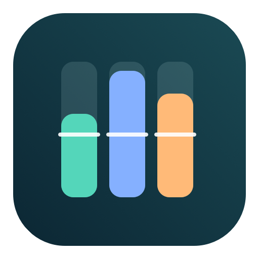
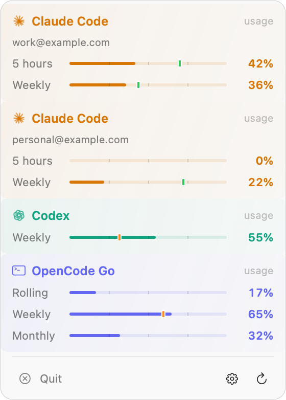
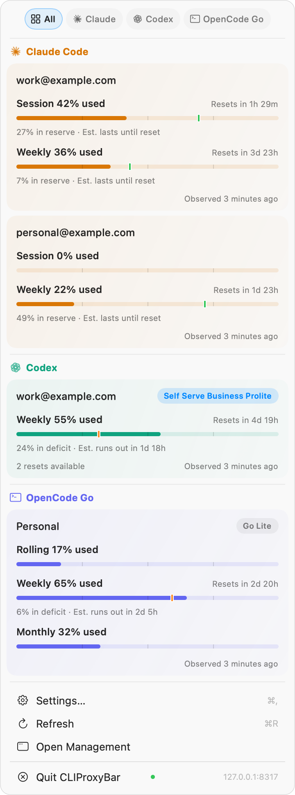

<p align="center">
  
</p>

<h1 align="center">CLIProxyBar</h1>
<p align="center">Your CLIProxyAPI quotas, at a glance. A standalone macOS menu bar app.</p>

CLIProxyBar connects to your local CLIProxyAPI instance and shows quota usage for each account.
A compact menu keeps the essentials close. Option-click opens an expanded view with reset times and pace indicators.

## Screenshots

<table>
  <tr>
    <th>Compact view</th>
    <th>Option-click for details</th>
  </tr>
  <tr>
    <td valign="top"></td>
    <td valign="top"></td>
  </tr>
</table>

Email addresses are blurred. The expanded screenshot shows the earlier app label in its Quit action.

## Features

- Compact and expanded menus with provider colors and quota gauges.
- Usage or remaining percentages, with optional provider indicators in the menu bar.
- Pace markers and reserve or deficit estimates for supported fixed quota windows.
- Cached readings at launch, followed by fresh provider requests.
- One refresh action, a refresh indicator inside the menu, and the ⌘R shortcut.
- Local proxy URL and management key settings, available with ⌘,.

## Supported quotas

| Provider | Windows | Extra information |
| --- | --- | --- |
| Claude Code | Five-hour session, weekly | Plan label when CLIProxyAPI supplies it |
| Codex | Session, weekly | Plan label and available resets when the provider supplies them |
| OpenCode Go | Rolling, weekly, monthly | Plan label through the generic plugin quota API |

OpenCode Go requires CLIProxyAPI v8 and a plugin that implements the generic quota capability.
The companion [OpenCode Go plugin](https://github.com/massiveits/opencode-go-cliproxyapi) needs the native quota changes in [upstream pull request #10](https://github.com/massiveits/opencode-go-cliproxyapi/pull/10).
A plugin version that exposes only its separate quota page does not work with this integration.

Pace compares used quota with elapsed time in a fixed window. It is an estimate, not a provider guarantee.
OpenCode Go weekly quotas have pace indicators. Its rolling and monthly responses do not supply enough window metadata for pace calculations.
Unsupported providers can appear as accounts without active quota readings.

## Requirements

- macOS 14 Sonoma or later, on Apple Silicon or Intel.
- A local CLIProxyAPI instance with management access enabled.
- Your CLIProxyAPI management key. This key is different from a client API key.
- Accounts already configured in CLIProxyAPI.

CLIProxyBar displays quotas and opens local management. CLIProxyAPI manages the provider accounts and proxy service.

## Install

1. Download the macOS ZIP from [Releases](https://github.com/darfink/cliproxybar/releases).
2. Extract the ZIP.
3. Move `CLIProxyBar.app` into Applications.
4. Open the app.
5. Enter the local proxy URL and management key in Settings.
6. Click **Apply** for the URL, then **Save** for the key.

The default URL is `http://127.0.0.1:8317`. The app opens Settings on first launch when no management key exists.

The default release has an ad hoc signature. It has no Apple notarization.
If macOS blocks the downloaded app, open **System Settings → Privacy & Security** and select **Open Anyway** after attempting to open it.

## Use

| Action | Result |
| --- | --- |
| Click the menu bar item | Open the compact menu |
| Option-click the menu bar item | Open the expanded menu |
| ⌘R or Refresh | Fetch quotas for all supported accounts |
| ⌘, or Settings | Change the display, visible providers, proxy URL, or management key |
| Open Local Management | Open your proxy's management page in the browser |

Automatic refresh runs every five minutes. A failed request retains the previous reading and shows its status.
The browser management page handles its own authentication. CLIProxyBar does not put the management key in browser URLs.

## Privacy

The app accepts HTTP loopback URLs only: `localhost`, `127.0.0.1`, or `[::1]`.
It refuses redirects for management requests. It stores the management key in macOS Keychain.
Provider quota requests go through CLIProxyAPI with the selected account. The app does not read provider token files directly.

The quota cache contains account display names, quota values, and timestamps. It contains no management key or authentication index.
The cache lives at `~/Library/Application Support/CLIProxyBar/quota-cache.json`, with owner-only permissions.
The app includes no telemetry or automatic updater.

## Build from source

Install Xcode or the Xcode Command Line Tools with Swift 6 or later.

```sh
git clone https://github.com/darfink/cliproxybar.git
cd cliproxybar
swift test
./build.sh
open dist/CLIProxyBar.app
```

For a universal app, run:

```sh
./build.sh --universal
./scripts/package-release.sh
```

The build accepts SwiftPM flags. Restricted development environments can pass `--disable-sandbox` and specify writable Swift module caches.
The app has no external Swift package dependencies.

## Development and releases

[CONTRIBUTING.md](CONTRIBUTING.md) describes tests and development.
[docs/RELEASING.md](docs/RELEASING.md) describes GitHub Releases and optional Apple signing.
GitHub Actions runs tests and builds on Apple Silicon and Intel.
Version tags trigger a verified universal app build, ZIP packaging, checksums, and a GitHub Release.
Dependabot checks GitHub Actions weekly.

Existing users of the extracted Quotio Menu Bar keep their display settings, cached readings, and management key during migration.
The app preserves the legacy Keychain item.

## Attribution

CLIProxyBar derives from [Quotio](https://github.com/nguyenphutrong/quotio), by Trong Nguyen, under the MIT license.
See [NOTICE.md](NOTICE.md) and [LICENSE](LICENSE) for attribution.
CLIProxyBar is an independent project with no affiliation with CLIProxyAPI or the providers shown in the app.
